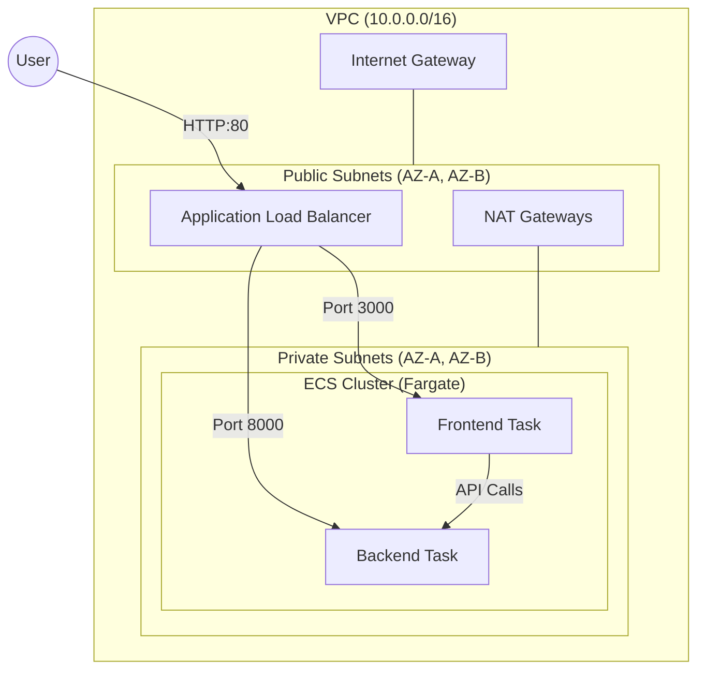

# PG-AGI DevOps Assignment

This repository contains a full-stack application (FastAPI + Next.js) with a robust CI/CD pipeline and multi-cloud infrastructure (AWS & GCP) managed via Terraform.

## 📂 Folder Structure

```text
.
├── .github/workflows/       # CI/CD Pipeline Definitions
│   ├── intergration-ci.yaml # PR-based tests (Pytest & Playwright)
│   ├── ECR.yaml            # Build & Push images to AWS/GCP registries
│   └── deploy.yaml         # Multi-cloud infrastructure & app deployment
├── backend/                # FastAPI Application
│   ├── app/
│   │   └── main.py         # API Routes and Logic
│   ├── test/
│   │   └── test_routes.py  # Unit tests for backend
│   └── Dockerfile          # Backend containerization
├── frontend/               # Next.js Application
│   ├── pages/
│   │   └── index.js        # Main UI and Backend integration
│   ├── tests/              # E2E tests (Playwright)
│   └── Dockerfile          # Frontend containerization
├── infra/                  # Terraform Infrastructure as Code
│   ├── aws/                # AWS Resources (VPC, ECS, ALB)
│   └── gcp/                # GCP Resources (Cloud Run, IAM)
└── docker-compose.yaml     # Local development setup
```

---

## 🚀 Backend API (FastAPI)

The backend is built with FastAPI, providing a high-performance asynchronous API.

### Routes
| Method | Endpoint | Description |
| :--- | :--- | :--- |
| `GET` | `/health` | Returns the health status of the backend service. |
| `GET` | `/message` | Returns a confirmation message of successful integration. |

---

## 💻 Frontend (Next.js)

The frontend is a Next.js application that provides a modern UI and integrates with the backend API.

### Routes
| Path | Component | Description |
| :--- | :--- | :--- |
| `/` | `index.js` | The main landing page. It checks backend health and displays the integration message. |

---

## 🛠️ CI/CD Pipelines (GitHub Actions)

We use three primary workflows to ensure code quality and automated deployments.

### 1. Integration CI (`intergration-ci.yaml`)
*   **Trigger**: Pull Requests to the `develop` branch.
*   **Actions**:
    *   Runs Python unit tests using `pytest`.
    *   Executes End-to-End (E2E) tests using `Playwright`.
    *   Ensures the backend and frontend can communicate before merging.

### 2. Build & Push (`ECR.yaml`)
*   **Trigger**: Push to the `develop` branch.
*   **Actions**:
    *   Builds Docker images for both Backend and Frontend.
    *   Pushes images to **AWS Elastic Container Registry (ECR)**.
    *   Pushes images to **GCP Artifact Registry**.

### 3. Deploy (`deploy.yaml`)
*   **Trigger**: Push to the `main` branch.
*   **Actions**:
    *   **Bootstrap**: Initializes and applies Terraform for both AWS and GCP.
    *   **Build & Push**: Re-builds images with the latest commit tag.
    *   **Deploy**: Updates AWS ECS services and GCP Cloud Run services with the new images.

---

## ☁️ Infrastructure

### 🟠 AWS Infrastructure
The AWS setup is designed for high availability and scalability.

#### Components:
*   **VPC**: Custom VPC with public and private subnets across multiple Availability Zones.
*   **Networking**: Internet Gateway for public access and NAT Gateways for private subnet egress.
*   **ALB**: Application Load Balancer to distribute traffic to ECS tasks.
*   **ECS (Fargate)**: Serverless container orchestration for running backend and frontend services.
*   **Monitoring**: CloudWatch Alarms and SNS for real-time alerting.

---

## 📊 Monitoring & Alerting (AWS)

The project includes a comprehensive monitoring setup using **AWS CloudWatch** and **SNS**.

### CloudWatch Dashboard
A custom dashboard is created to track the health and performance of the application:
*   **Frontend CPU**: Average CPU utilization for the frontend ECS service.
*   **Backend CPU**: Average CPU utilization for the backend ECS service.
*   **ALB Request Count**: Total number of requests processed by the Load Balancer.
*   **Backend Latency**: Average target response time for the backend service.

### Alarms & Notifications
*   **High CPU Alarm**: Triggers if CPU utilization exceeds **70%** for 5 consecutive minutes on either the frontend or backend service.
*   **SNS Alerts**: Notifications are sent via an SNS topic to the configured `alert_email` whenever an alarm state is reached.

---
### 🌐 Deployment Access
Once deployed, the application can be accessed via the following URLs:

#### AWS (Production)
The application is accessible through the **Application Load Balancer (ALB) DNS name**.
*   **Frontend**: `http://<ALB_DNS_NAME>`
*   **Backend**: `http://<ALB_DNS_NAME>/health` (or as configured in listener rules)

#### GCP (Production)
The application is accessible through the **Cloud Run Service URLs**.
*   **Frontend**: `https://frontend-<hash>.run.app`
*   **Backend**: `https://backend-<hash>.run.app`

---

## 🔍 Retrieving Deployment URLs

You can retrieve the actual deployment URLs by running the following commands in their respective infrastructure directories:

### AWS
```bash
cd infra/aws
terraform output alb_dns
```

### GCP
```bash
cd infra/gcp
terraform output frontend_url
terraform output backend_url
```

---

## 🏗️ Detailed Architecture

### 🟠 AWS Architecture (High Availability & Scalability)

The AWS infrastructure is designed following best practices for security, high availability, and scalability.

#### 1. Networking (VPC)
*   **VPC**: A custom VPC with a `10.0.0.0/16` CIDR block.
*   **Subnets**:
    *   **Public Subnets (x2)**: Hosted in two different Availability Zones (AZs) for the Application Load Balancer.
    *   **Private Subnets (x2)**: Hosted in two different AZs for the ECS Fargate tasks, ensuring no direct internet exposure.
*   **Gateways**:
    *   **Internet Gateway (IGW)**: Provides internet access for public subnets.
    *   **NAT Gateways (x2)**: Deployed in each public subnet to allow private subnet resources (ECS tasks) to access the internet securely (e.g., for pulling images or updates).

#### 2. Compute (ECS Fargate)
*   **Cluster**: A serverless ECS Cluster (`dev-pgagi-cluster`).
*   **Services**:
    *   **Frontend Service**: Runs the Next.js container.
    *   **Backend Service**: Runs the FastAPI container.
*   **Task Definitions**: Define CPU/Memory limits, container images (from ECR), and environment variables.

#### 3. Load Balancing (ALB)
*   **ALB**: An internet-facing Application Load Balancer that distributes traffic.
*   **Listeners**: Listens on Port 80 (HTTP).
*   **Target Groups**:
    *   **Frontend TG**: Forwards traffic to the frontend containers on port 3000.
    *   **Backend TG**: Forwards traffic to the backend containers on port 8000.

#### 4. Security & IAM
*   **Security Groups**:
    *   **ALB SG**: Allows inbound HTTP (80) from anywhere.
    *   **ECS SG**: Allows inbound traffic ONLY from the ALB Security Group on ports 3000 and 8000.
*   **IAM Roles**: Dedicated Task Execution Roles for ECS to pull images from ECR and log to CloudWatch.

#### 📊 AWS Architecture Diagram


> [!IMPORTANT]
> **AWS Architecture Diagram**
> 

---

### 🔵 GCP Architecture (Serverless & Managed)

The GCP infrastructure leverages serverless components for rapid deployment and minimal operational overhead.

#### 1. Compute (Cloud Run)
*   **Frontend Service**: A fully managed Cloud Run service running the Next.js application.
*   **Backend Service**: A fully managed Cloud Run service running the FastAPI application.
*   **Autoscaling**: Automatically scales based on request volume.

#### 2. Networking & Access
*   **Public Access**: Services are configured with `allUsers` invoker permissions for public accessibility.
*   **Service Communication**: The frontend communicates with the backend via the backend's unique Cloud Run URL.

#### 3. Artifact Management
*   **Artifact Registry**: A regional Docker repository (`pg-agi-docker`) used to store and manage container images.

#### 4. IAM & Security
*   **Service Accounts**: Dedicated service accounts for frontend and backend services to adhere to the principle of least privilege.

#### 📊 GCP Architecture Diagram
> [!IMPORTANT]
> 

---


## 🛠️ Local Development

To run the entire stack locally using Docker Compose:

```bash
docker-compose up --build
```

The frontend will be available at `http://localhost:3000` and the backend at `http://localhost:8000` on the local computer
